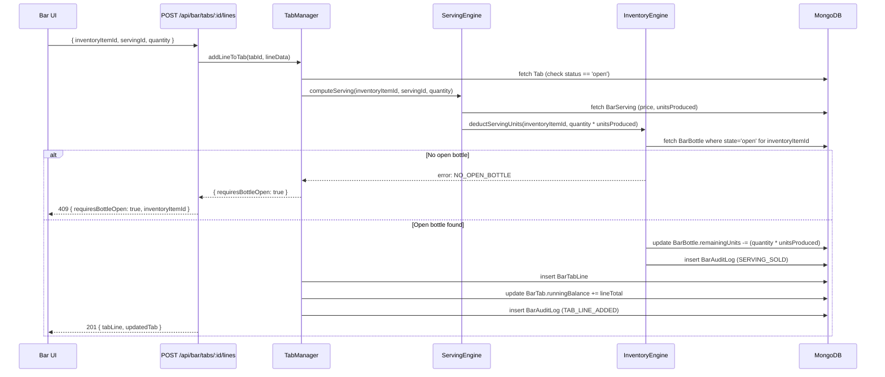
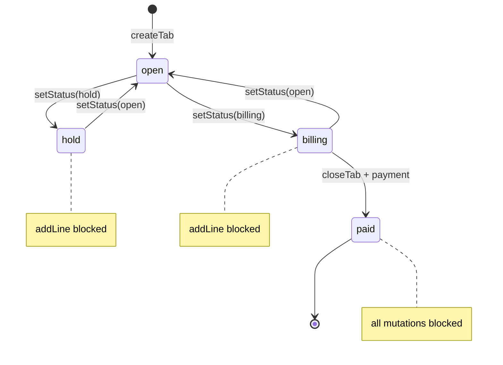

# Design Document: Wines & Spirits Module

## Overview

The Wines & Spirits Module is a comprehensive bar management system built on top of the existing multi-tenant POS platform. It extends the current minimal `/api/bar/sale` endpoint into a full-featured domain covering brand and inventory management, dynamic serving configuration, physical bottle lifecycle tracking, multi-item tab management with running balances, flexible payment recording, and complete audit trails.

The design philosophy follows the existing codebase patterns: per-tenant MongoDB connections via `getTenantDB`, model factories in `getModels`, Next.js App Router API routes, and React component pages under `/app/dashboard/bar`. The module is gated behind the existing `bar.tabs` feature flag and integrates with the existing `Sale`, `Customer`, `Staff`, and `Branch` models without modification.

Key design decisions:

- **Serving Engine abstraction**: portion tracking operates on generic `Unit/Portion` concepts, making it reusable for pizza, cake, cheese, and any other divisible inventory.
- **Immediate inventory deduction**: stock changes on tab-add and on serving, not on payment — matching real bar operations.
- **Incremental migration**: the existing bar sale route and BarPage component are refactored in five phases to preserve backward compatibility throughout.
- **Single open bottle constraint**: enforced at the database level with a partial unique index so only one bottle per inventory item can have `state: 'open'` at a time.


## Architecture

### High-Level Component Diagram

```mermaid
graph TD
    subgraph "Next.js App Router"
        LP[Landing Page\n/dashboard/bar]
        TP[Tab Detail Page\n/dashboard/bar/tabs/:id]
        INV[Inventory Page\n/dashboard/bar/inventory]
        BRAND[Brand Page\n/dashboard/bar/brands]
        REPORTS[Reports Page\n/dashboard/bar/reports]
    end

    subgraph "API Layer"
        API_TABS[/api/bar/tabs]
        API_BRANDS[/api/bar/brands]
        API_ITEMS[/api/bar/inventory-items]
        API_SERVINGS[/api/bar/servings]
        API_BOTTLES[/api/bar/bottles]
        API_SALE[/api/bar/sale  (refactored)]
        API_REPORTS[/api/bar/reports]
    end

    subgraph "Service Layer"
        SE[ServingEngine\nlib/bar/serving-engine.ts]
        IE[InventoryEngine\nlib/bar/inventory-engine.ts]
        TM[TabManager\nlib/bar/tab-manager.ts]
        PH[PaymentHandler\nlib/bar/payment-handler.ts]
    end

    subgraph "Data Layer (per-tenant MongoDB)"
        BB[BarBrand]
        BI[BarInventoryItem]
        BS[BarServing]
        BBOT[BarBottle]
        BT[BarTab]
        BTL[BarTabLine]
        BAL[BarAuditLog]
        SALE[Sale (existing)]
        CUST[Customer (existing)]
        STAFF[Staff (existing)]
    end

    LP --> API_TABS
    TP --> API_TABS
    TP --> API_BRANDS
    TP --> API_ITEMS
    INV --> API_ITEMS
    INV --> API_BOTTLES
    BRAND --> API_BRANDS

    API_TABS --> TM
    API_SALE --> PH
    API_ITEMS --> IE
    API_SERVINGS --> SE

    TM --> BT
    TM --> BTL
    TM --> IE
    TM --> BAL
    IE --> BB
    IE --> BI
    IE --> BBOT
    IE --> BAL
    SE --> BS
    SE --> BBOT
    PH --> SALE
    PH --> BT
    PH --> BAL
```

### Request Flow: Serving a Drink on a Tab




### Technology Stack

| Concern | Choice | Rationale |
|---|---|---|
| Database | MongoDB (Mongoose) | Matches existing schemas |
| API | Next.js App Router route handlers | Matches existing pattern |
| State management | Zustand store | Matches existing bar page pattern |
| UI components | shadcn/ui + Tailwind | Matches existing dashboard |
| Property testing | fast-check (TypeScript) | Mature TS PBT library |
| Unit testing | Vitest | Matches existing toolchain |

---

## Components and Interfaces

### Service Layer Interfaces

```typescript
// lib/bar/serving-engine.ts
export interface ServingEngine {
  /** Compute the total cost and unit deduction for a serving selection */
  computeServing(
    inventoryItemId: string,
    servingId: string,
    quantity: number
  ): Promise<{ lineTotal: number; unitsToDeduct: number }>

  /** List all configured servings for an inventory item */
  listServings(inventoryItemId: string): Promise<BarServing[]>

  /** Validate that a serving configuration is complete */
  validateServing(serving: Partial<BarServing>): ValidationResult
}

// lib/bar/inventory-engine.ts
export interface InventoryEngine {
  /** Deduct units from the currently open bottle */
  deductServingUnits(inventoryItemId: string, units: number): Promise<DeductResult>

  /** Sell a sealed bottle: deduct 1 from stock */
  sellSealedBottle(inventoryItemId: string, staffId: string): Promise<void>

  /** Open a new bottle: deduct 1 from sealed stock, create BarBottle record */
  openBottle(inventoryItemId: string, staffId: string): Promise<BarBottle>

  /** Close the current open bottle: record actualUnitsSold and difference */
  closeCurrentBottle(inventoryItemId: string): Promise<BarBottle>

  /** Get current open bottle for an inventory item, or null */
  getOpenBottle(inventoryItemId: string): Promise<BarBottle | null>
}

// lib/bar/tab-manager.ts
export interface TabManager {
  createTab(data: CreateTabInput): Promise<BarTab>
  addLine(tabId: string, line: AddLineInput): Promise<{ tab: BarTab; tabLine: BarTabLine }>
  removeLastLine(tabId: string): Promise<BarTab>
  setStatus(tabId: string, status: TabStatus): Promise<BarTab>
  applyDiscount(tabId: string, discountPct: number): Promise<BarTab>
  getRunningBalance(tabId: string): Promise<number>
}

// lib/bar/payment-handler.ts
export interface PaymentHandler {
  recordPayment(tabId: string, payment: PaymentInput): Promise<BarTabPayment>
  getRemainingBalance(tabId: string): Promise<number>
  closeTab(tabId: string): Promise<{ tab: BarTab; sale: Sale }>
}
```

### UI Component Hierarchy

```
app/dashboard/bar/
├── page.tsx                          # Landing: open tabs grid + quick actions
├── tabs/
│   ├── new/page.tsx                  # New tab modal flow
│   └── [id]/
│       └── page.tsx                  # Tab detail: product search + line items + payment
├── quick-sale/
│   └── page.tsx                      # Quick sale flow
├── inventory/
│   ├── page.tsx                      # Inventory items list
│   └── [id]/
│       └── page.tsx                  # Item detail: servings + bottle history
├── brands/
│   ├── page.tsx                      # Brand list
│   └── [id]/page.tsx                 # Brand detail + items
└── reports/
    └── page.tsx                      # Reports dashboard

components/bar/
├── landing/
│   ├── OpenTabsGrid.tsx              # Primary workspace: list of open tabs
│   ├── TabCard.tsx                   # Single tab summary card
│   ├── OutstandingBadge.tsx          # Total outstanding amount
│   └── RecentlyClosedList.tsx        # Recently closed tabs
├── tabs/
│   ├── NewTabForm.tsx                # Customer name / table / notes form
│   ├── TabStatusBadge.tsx            # Color-coded status pill
│   ├── TabLineItem.tsx               # Single line in a tab
│   ├── RunningBalanceBar.tsx         # Live balance display
│   ├── DiscountSelector.tsx          # 0/5/10/15/20% preset buttons
│   └── PaymentPanel.tsx              # Cash/Card/MobileMoney panel
├── product/
│   ├── BrandSearchInput.tsx          # Debounced brand/item search
│   ├── InventoryItemCard.tsx         # Item card with Sell Bottle / Serve buttons
│   ├── ServingOptionList.tsx         # Configured serving options per item
│   └── CategoryFilterBar.tsx        # Spirits/Beer/Wine/Cocktails filter
├── bottles/
│   ├── BottleOpenPrompt.tsx          # Confirm open new bottle dialog
│   ├── BottleStatusBadge.tsx         # Full / Open / Closed indicator
│   └── BottleDifferenceRow.tsx       # Expected vs Actual vs Diff row
└── reports/
    ├── OpenTabsReport.tsx
    ├── BottleDifferencesTable.tsx
    ├── StaffDifferenceReport.tsx
    └── ProductsSoldChart.tsx
```


---

## Data Models

All seven new schemas follow the existing conventions in `lib/models/schemas.ts`: they are exported as plain `mongoose.Schema` objects and registered by the model factory in `lib/tenant/get-models.ts` without binding to a specific connection.

Every new schema carries `userId` (owner) and optionally `branchId` for multi-branch support, and is indexed on both.

### Schema 1: BarBrand

```typescript
export const barBrandSchema = new mongoose.Schema(
  {
    userId:      { type: mongoose.Schema.Types.ObjectId, ref: 'User', required: true },
    branchId:    { type: mongoose.Schema.Types.ObjectId, ref: 'Branch' },
    name:        { type: String, required: true, trim: true },
    description: { type: String, default: '' },
    category:    { type: String, default: '' }, // 'whisky', 'vodka', 'wine', etc.
    isArchived:  { type: Boolean, default: false },
    createdAt:   { type: Date, default: Date.now },
    updatedAt:   { type: Date, default: Date.now },
  },
  { collection: 'bar_brands' }
)
barBrandSchema.index({ userId: 1, name: 1 }, { unique: true })
barBrandSchema.index({ userId: 1, branchId: 1, isArchived: 1 })
```

### Schema 2: BarInventoryItem

```typescript
export const barInventoryItemSchema = new mongoose.Schema(
  {
    userId:              { type: mongoose.Schema.Types.ObjectId, ref: 'User', required: true },
    branchId:            { type: mongoose.Schema.Types.ObjectId, ref: 'Branch' },
    brandId:             { type: mongoose.Schema.Types.ObjectId, ref: 'BarBrand', required: true },
    size:                { type: String, required: true },   // e.g. '1L', '750ml', '500ml'
    buyingPrice:         { type: Number, required: true },
    bottleSellingPrice:  { type: Number, required: true },
    stock:               { type: Number, required: true, default: 0 },  // sealed bottles
    lowStockThreshold:   { type: Number, default: 3 },
    isActive:            { type: Boolean, default: true },
    createdAt:           { type: Date, default: Date.now },
    updatedAt:           { type: Date, default: Date.now },
  },
  { collection: 'bar_inventory_items' }
)
barInventoryItemSchema.index({ userId: 1, branchId: 1, brandId: 1 })
barInventoryItemSchema.index({ userId: 1, branchId: 1, stock: 1 })
```

### Schema 3: BarServing

Represents a configured serving portion for a specific inventory item. The `unitsProduced` field is owner-defined and never auto-calculated from volume — this is the core of the generic serving engine design.

```typescript
export const barServingSchema = new mongoose.Schema(
  {
    userId:          { type: mongoose.Schema.Types.ObjectId, ref: 'User', required: true },
    branchId:        { type: mongoose.Schema.Types.ObjectId, ref: 'Branch' },
    inventoryItemId: { type: mongoose.Schema.Types.ObjectId, ref: 'BarInventoryItem', required: true },
    name:            { type: String, required: true, trim: true },  // 'Tot', 'Double', 'Quarter'
    sellingPrice:    { type: Number, required: true },
    unitsProduced:   { type: Number, required: true, min: 1 },  // owner-defined, positive integer
    isActive:        { type: Boolean, default: true },
    createdAt:       { type: Date, default: Date.now },
    updatedAt:       { type: Date, default: Date.now },
  },
  { collection: 'bar_servings' }
)
barServingSchema.index({ userId: 1, inventoryItemId: 1 })
barServingSchema.index({ userId: 1, branchId: 1 })
```

### Schema 4: BarBottle

Tracks the lifecycle of an individual physical bottle from Full → Open → Closed. The `remainingUnits` field tracks how many serving-units remain in the currently open bottle.

```typescript
export const barBottleSchema = new mongoose.Schema(
  {
    userId:          { type: mongoose.Schema.Types.ObjectId, ref: 'User', required: true },
    branchId:        { type: mongoose.Schema.Types.ObjectId, ref: 'Branch' },
    inventoryItemId: { type: mongoose.Schema.Types.ObjectId, ref: 'BarInventoryItem', required: true },
    bottleNumber:    { type: Number, required: true },  // sequential per inventory item
    state:           { type: String, enum: ['full', 'open', 'closed'], required: true },
    openedBy:        { type: mongoose.Schema.Types.ObjectId, ref: 'Staff' },
    openedAt:        { type: Date },
    closedAt:        { type: Date },
    expectedUnits:   { type: Number },  // from BarServing.unitsProduced at open time
    remainingUnits:  { type: Number },  // decrements as servings are sold
    actualUnitsSold: { type: Number },  // computed on close: expectedUnits - remainingUnits
    difference:      { type: Number },  // expectedUnits - actualUnitsSold (negative = loss)
    createdAt:       { type: Date, default: Date.now },
    updatedAt:       { type: Date, default: Date.now },
  },
  { collection: 'bar_bottles' }
)
// Partial unique index: only one open bottle per inventory item per branch
barBottleSchema.index(
  { userId: 1, branchId: 1, inventoryItemId: 1, state: 1 },
  { unique: true, partialFilterExpression: { state: 'open' } }
)
barBottleSchema.index({ userId: 1, branchId: 1, inventoryItemId: 1, createdAt: -1 })
barBottleSchema.index({ userId: 1, branchId: 1, state: 1 })
```


### Schema 5: BarTab

The central tab document. Payments are embedded as a sub-array to support future partial payments without a schema migration.

```typescript
const barTabPaymentSchema = new mongoose.Schema(
  {
    amount:         { type: Number, required: true },
    method:         { type: String, enum: ['cash', 'card', 'mobile_money'], required: true },
    amountGiven:    { type: Number },         // cash overpay tracking
    change:         { type: Number },
    mpesaCode:      { type: String },
    mpesaPhone:     { type: String },
    recordedBy:     { type: mongoose.Schema.Types.ObjectId, ref: 'Staff' },
    recordedAt:     { type: Date, default: Date.now },
  },
  { _id: true }
)

export const barTabSchema = new mongoose.Schema(
  {
    userId:         { type: mongoose.Schema.Types.ObjectId, ref: 'User', required: true },
    branchId:       { type: mongoose.Schema.Types.ObjectId, ref: 'Branch' },
    staffId:        { type: mongoose.Schema.Types.ObjectId, ref: 'Staff' },
    tabNumber:      { type: String, required: true },
    customerId:     { type: mongoose.Schema.Types.ObjectId, ref: 'Customer' },
    customerName:   { type: String, default: '' },
    tableNumber:    { type: String, default: '' },
    notes:          { type: String, default: '' },
    status:         { type: String, enum: ['open', 'hold', 'billing', 'paid'], default: 'open' },
    subtotal:       { type: Number, default: 0 },
    discountPct:    { type: Number, default: 0, min: 0, max: 100 },
    discountAmount: { type: Number, default: 0 },
    total:          { type: Number, default: 0 },
    amountPaid:     { type: Number, default: 0 },  // sum of payments
    payments:       { type: [barTabPaymentSchema], default: [] },
    saleId:         { type: mongoose.Schema.Types.ObjectId, ref: 'Sale' },  // set on close
    openedAt:       { type: Date, default: Date.now },
    closedAt:       { type: Date },
    synced:         { type: Boolean, default: true },
    createdAt:      { type: Date, default: Date.now },
    updatedAt:      { type: Date, default: Date.now },
  },
  { collection: 'bar_tabs' }
)
barTabSchema.index({ userId: 1, branchId: 1, status: 1 })
barTabSchema.index({ userId: 1, branchId: 1, openedAt: -1 })
barTabSchema.index({ userId: 1, tabNumber: 1 }, { unique: true })
```

### Schema 6: BarTabLine

Individual line items added to a tab. Each line references either a serving (portion sale) or null (sealed bottle sale).

```typescript
export const barTabLineSchema = new mongoose.Schema(
  {
    userId:          { type: mongoose.Schema.Types.ObjectId, ref: 'User', required: true },
    branchId:        { type: mongoose.Schema.Types.ObjectId, ref: 'Branch' },
    tabId:           { type: mongoose.Schema.Types.ObjectId, ref: 'BarTab', required: true },
    inventoryItemId: { type: mongoose.Schema.Types.ObjectId, ref: 'BarInventoryItem', required: true },
    servingId:       { type: mongoose.Schema.Types.ObjectId, ref: 'BarServing' },  // null = bottle sale
    itemName:        { type: String, required: true },   // denormalized for receipt display
    servingName:     { type: String, default: '' },      // denormalized for receipt display
    quantity:        { type: Number, required: true, min: 1 },
    unitPrice:       { type: Number, required: true },
    lineTotal:       { type: Number, required: true },
    addedBy:         { type: mongoose.Schema.Types.ObjectId, ref: 'Staff' },
    addedAt:         { type: Date, default: Date.now },
    voided:          { type: Boolean, default: false },
    voidedBy:        { type: mongoose.Schema.Types.ObjectId, ref: 'Staff' },
    voidedAt:        { type: Date },
  },
  { collection: 'bar_tab_lines' }
)
barTabLineSchema.index({ userId: 1, tabId: 1, addedAt: -1 })
barTabLineSchema.index({ userId: 1, inventoryItemId: 1, addedAt: -1 })
```

### Schema 7: BarAuditLog

Immutable ledger of all significant bar operations. Records are never updated or deleted — only inserted.

```typescript
export const barAuditLogSchema = new mongoose.Schema(
  {
    userId:      { type: mongoose.Schema.Types.ObjectId, ref: 'User', required: true },
    branchId:    { type: mongoose.Schema.Types.ObjectId, ref: 'Branch' },
    staffId:     { type: mongoose.Schema.Types.ObjectId, ref: 'Staff', required: true },
    operation:   {
      type: String,
      enum: [
        'TAB_CREATED', 'TAB_LINE_ADDED', 'TAB_STATUS_CHANGED',
        'TAB_DISCOUNT_APPLIED', 'TAB_CLOSED',
        'SERVING_SOLD', 'BOTTLE_SOLD',
        'BOTTLE_OPENED', 'BOTTLE_CLOSED',
        'INVENTORY_ADJUSTED',
      ],
      required: true,
    },
    referenceId:   { type: String },         // tabId, bottleId, etc.
    referenceType: { type: String },         // 'BarTab', 'BarBottle', etc.
    details:       { type: mongoose.Schema.Types.Mixed, default: {} },
    timestamp:     { type: Date, default: Date.now },
  },
  { collection: 'bar_audit_logs' }
)
barAuditLogSchema.index({ userId: 1, branchId: 1, timestamp: -1 })
barAuditLogSchema.index({ userId: 1, staffId: 1, timestamp: -1 })
barAuditLogSchema.index({ userId: 1, operation: 1, timestamp: -1 })
// No pre-save hooks — intentionally immutable
```

### Model Factory Registration

The seven new schemas are added to `lib/tenant/get-models.ts`:

```typescript
import {
  // ...existing imports...
  barBrandSchema, barInventoryItemSchema, barServingSchema,
  barBottleSchema, barTabSchema, barTabLineSchema, barAuditLogSchema,
} from '@/lib/models/schemas'

export function getModels(conn: mongoose.Connection) {
  return {
    // ...existing models...
    BarBrand:        conn.models.BarBrand        || conn.model('BarBrand',        barBrandSchema),
    BarInventoryItem: conn.models.BarInventoryItem || conn.model('BarInventoryItem', barInventoryItemSchema),
    BarServing:      conn.models.BarServing      || conn.model('BarServing',      barServingSchema),
    BarBottle:       conn.models.BarBottle       || conn.model('BarBottle',       barBottleSchema),
    BarTab:          conn.models.BarTab          || conn.model('BarTab',          barTabSchema),
    BarTabLine:      conn.models.BarTabLine      || conn.model('BarTabLine',      barTabLineSchema),
    BarAuditLog:     conn.models.BarAuditLog     || conn.model('BarAuditLog',     barAuditLogSchema),
  }
}
```


---

## API Endpoints

All endpoints follow the existing Next.js App Router pattern: `export async function GET/POST/PATCH/DELETE(request: NextRequest)` in `app/api/bar/**`. Auth is verified via `getAuthPayload()` and the tenant DB is retrieved via `getTenantDB(request)`.

### Bar Brands

| Method | Path | Description |
|---|---|---|
| GET | `/api/bar/brands` | List all brands (supports `?search=&category=&archived=false`) |
| POST | `/api/bar/brands` | Create brand |
| GET | `/api/bar/brands/[id]` | Get brand with its inventory items |
| PATCH | `/api/bar/brands/[id]` | Update brand name/description/category |
| DELETE | `/api/bar/brands/[id]` | Archive brand (soft delete) |

### Bar Inventory Items

| Method | Path | Description |
|---|---|---|
| GET | `/api/bar/inventory-items` | List items (`?brandId=&lowStock=true`) |
| POST | `/api/bar/inventory-items` | Create item linked to brand |
| GET | `/api/bar/inventory-items/[id]` | Get item with open bottle status |
| PATCH | `/api/bar/inventory-items/[id]` | Update price / threshold |
| POST | `/api/bar/inventory-items/[id]/stock` | Adjust stock (+ or -) with reason |

### Bar Servings

| Method | Path | Description |
|---|---|---|
| GET | `/api/bar/inventory-items/[id]/servings` | List servings for an item |
| POST | `/api/bar/inventory-items/[id]/servings` | Create serving config |
| PATCH | `/api/bar/servings/[id]` | Update serving name/price/units |
| DELETE | `/api/bar/servings/[id]` | Delete serving (blocked if has transaction history) |

### Bar Bottles

| Method | Path | Description |
|---|---|---|
| GET | `/api/bar/bottles` | List bottles (`?inventoryItemId=&state=&staffId=`) |
| POST | `/api/bar/bottles/open` | Open a new bottle (closes current if exists) |
| POST | `/api/bar/bottles/[id]/close` | Manually close a bottle |
| GET | `/api/bar/bottles/[id]` | Get bottle detail with difference |

### Bar Tabs

| Method | Path | Description |
|---|---|---|
| GET | `/api/bar/tabs` | List tabs (`?status=open`) |
| POST | `/api/bar/tabs` | Create a new tab |
| GET | `/api/bar/tabs/[id]` | Get tab with lines and payments |
| PATCH | `/api/bar/tabs/[id]` | Update customerName / tableNumber / notes / status / discountPct |
| POST | `/api/bar/tabs/[id]/lines` | Add a line item (triggers inventory deduction) |
| DELETE | `/api/bar/tabs/[id]/lines/[lineId]` | Void a line item (restores inventory) |
| POST | `/api/bar/tabs/[id]/payments` | Record a payment |
| POST | `/api/bar/tabs/[id]/close` | Close tab, create Sale record |

### Bar Sale (Refactored)

The existing `/api/bar/sale` endpoint is preserved for backward compatibility and extended to handle both quick sales and tab closures. It now accepts a `type` field (`'quick_sale'` or `'tab_close'`).

### Bar Reports

| Method | Path | Description |
|---|---|---|
| GET | `/api/bar/reports/open-tabs` | All open tabs with balances |
| GET | `/api/bar/reports/closed-tabs` | All paid tabs in date range |
| GET | `/api/bar/reports/outstanding` | Sum of all open tab balances |
| GET | `/api/bar/reports/bottle-differences` | All closed bottles with expected/actual/diff |
| GET | `/api/bar/reports/products-sold` | Qty and revenue per product |
| GET | `/api/bar/reports/top-brands` | Brands ranked by sales volume |
| GET | `/api/bar/reports/staff-differences` | Total bottle differences per staff |
| GET | `/api/bar/reports/audit-log` | Audit log (`?staffId=&operation=&from=&to=`) |

### Bar Audit Log

| Method | Path | Description |
|---|---|---|
| GET | `/api/bar/audit` | Query audit logs (read-only, no POST/PATCH/DELETE) |


---

## Serving Engine Abstraction

The `ServingEngine` is designed around generic abstractions so it can be reused outside the bar context. The core idea is that a **Container** (a bottle, a cake, a pizza) has an **owner-defined unit count**, and a **Portion** (a tot, a slice) consumes some number of those units.

```
Container (BarInventoryItem + BarBottle)
  ├── capacity: N units           (owner-defined, e.g. 25 tots per bottle)
  └── Portion (BarServing)
        ├── name: "Single Tot"
        ├── sellingPrice: 200
        └── unitsConsumed: 1     (per portion)

Selling 2 × "Single Tot" → deducts 2 units from the open container
```

The `ServingEngine` never interprets millilitres, percentages, or any domain-specific unit. It treats `unitsProduced` as an opaque positive integer. This makes it applicable to:
- **Bar**: 1L bottle → 25 tots (owner decides 25)
- **Pizza**: 1 large pizza → 8 slices
- **Cheese board**: 1 block → 12 portions
- **Cake**: 1 cake → 10 slices

### ServingEngine Core Logic

```typescript
// lib/bar/serving-engine.ts

export class ServingEngine {
  /**
   * For any divisible container, compute the cost and unit deduction
   * for a requested portion quantity.
   *
   * @param serving  - The BarServing configuration (price, unitsProduced)
   * @param quantity - How many portions are being sold
   * @returns { lineTotal, unitsToDeduct }
   */
  static computeServing(
    serving: { sellingPrice: number; unitsProduced: number },
    quantity: number
  ): { lineTotal: number; unitsToDeduct: number } {
    if (quantity < 1 || !Number.isInteger(quantity)) {
      throw new Error('Quantity must be a positive integer')
    }
    return {
      lineTotal: serving.sellingPrice * quantity,
      unitsToDeduct: serving.unitsProduced * quantity,
    }
  }
}
```

---

## Tab Balance Computation

The running balance is always computed deterministically from the tab's line items and payments. It is never stored as a free-floating number — it is derived on every read to prevent drift.

```
subtotal       = sum(line.lineTotal for line in lines where NOT line.voided)
discountAmount = subtotal * (discountPct / 100)
total          = subtotal - discountAmount
amountPaid     = sum(payment.amount for payment in payments)
remaining      = total - amountPaid
```

The `subtotal`, `discountAmount`, `total`, and `amountPaid` fields on `BarTab` are **cached values** updated on every mutation. The source of truth is always the embedded `lines` and `payments` arrays. This provides O(1) balance reads while keeping the invariant checkable at any time.

---

## State Management

### Zustand Bar Store

```typescript
// store/bar-store.ts
interface BarState {
  // Landing page state
  openTabs: BarTab[]
  recentlyClosed: BarTab[]
  outstandingTotal: number

  // Active tab state
  activeTabId: string | null
  activeTab: BarTab | null
  tabLines: BarTabLine[]

  // Product search state
  searchQuery: string
  categoryFilter: string | null
  searchResults: BarInventoryItem[]

  // Bottle prompt state
  pendingBottleOpen: { inventoryItemId: string; servingId: string } | null

  // Actions
  loadLandingData: () => Promise<void>
  openTab: (data: CreateTabInput) => Promise<BarTab>
  addLine: (inventoryItemId: string, servingId: string | null, qty: number) => Promise<void>
  setBottleOpenConfirmed: (inventoryItemId: string) => Promise<void>
  setTabStatus: (tabId: string, status: TabStatus) => Promise<void>
  applyDiscount: (discountPct: number) => Promise<void>
  recordPayment: (payment: PaymentInput) => Promise<void>
  closeTab: (tabId: string) => Promise<Sale>
  setSearchQuery: (q: string) => void
  setCategoryFilter: (cat: string | null) => void
}
```

### Key State Transitions




---

## Integration with Existing Models

### Sale Model Integration

When a tab is closed (`POST /api/bar/tabs/[id]/close`), the system creates a `Sale` record using the existing `saleSchema`. The bar-specific data is mapped as follows:

```typescript
const sale = new models.Sale({
  userId:        ownerId,
  staffId:       tab.staffId,
  orderNumber:   tab.tabNumber,
  customerId:    tab.customerId,
  customerName:  tab.customerName,
  items: tabLines.map(line => ({
    productId:   line.inventoryItemId,  // BarInventoryItem _id as product reference
    productName: line.servingName
                   ? `${line.itemName} (${line.servingName})`
                   : line.itemName,
    quantity:    line.quantity,
    price:       line.unitPrice,
    discount:    0,
  })),
  subtotal:      tab.subtotal,
  discount:      tab.discountAmount,
  total:         tab.total,
  amountPaid:    tab.amountPaid,
  paymentMethod: tab.payments[tab.payments.length - 1].method,
  mpesaCode:     tab.payments.find(p => p.mpesaCode)?.mpesaCode,
  mpesaPhone:    tab.payments.find(p => p.mpesaPhone)?.mpesaPhone,
  notes:         tab.notes,
  source:        'bar',       // Requirement 21.3
  status:        'completed',
  synced:        true,
})
```

The `saleId` is then written back to the `BarTab` document.

### Customer Model Integration

The `customerId` field on `BarTab` is an optional reference to the existing `Customer` model. When a customer is selected from the customer directory during tab creation, their `_id` is stored. This allows customer purchase history to reflect bar transactions.

### Staff Model Integration

The existing `Staff` model provides authentication (`getAuthPayload()` returns `staffId` for staff logins) and permissions (`bar.tabs` permission key). All bar operations receive the `staffId` from the auth payload and record it on all created/updated documents and `BarAuditLog` entries.

### Branch Model Integration

The `branchId` is resolved from the auth session or request headers (matching the existing pharmacy module pattern). All bar documents are scoped to `{ userId, branchId }` enabling inventory isolation per physical location.

---

## Migration Plan

The migration is structured into five phases to minimize risk and preserve the working existing bar sale functionality throughout.

### Phase 1: Schema Foundation (No Breaking Changes)

**Goal**: Add the seven new schemas to `schemas.ts` and register them in `get-models.ts`. No existing routes are touched.

**Tasks**:
1. Add `barBrandSchema`, `barInventoryItemSchema`, `barServingSchema`, `barBottleSchema`, `barTabSchema`, `barTabLineSchema`, `barAuditLogSchema` to `lib/models/schemas.ts`
2. Register all seven models in `lib/tenant/get-models.ts`
3. Add new feature flags to `modules.ts` (`bar.inventory`, `bar.reports`, `bar.admin`) while keeping `bar.tabs` unchanged
4. Run smoke tests: existing bar sale endpoint still returns 201

### Phase 2: Core API Routes

**Goal**: Build all new API routes as additive — the old `/api/bar/sale` is untouched.

**Tasks**:
1. Implement `/api/bar/brands` CRUD
2. Implement `/api/bar/inventory-items` CRUD with serving sub-routes
3. Implement `/api/bar/bottles` open/close
4. Implement `/api/bar/tabs` CRUD with line management
5. Implement service layer: `ServingEngine`, `InventoryEngine`, `TabManager`, `PaymentHandler`
6. Write unit tests for service layer with Vitest

### Phase 3: UI Components

**Goal**: Build the new UI without touching the existing bar page.

**Tasks**:
1. Build all `components/bar/**` components with placeholder data
2. Build `app/dashboard/bar/` page hierarchy
3. Wire Zustand store
4. Connect components to Phase 2 API routes
5. Test on tablet viewport

### Phase 4: Refactor Existing Bar Sale Route

**Goal**: Update `/api/bar/sale` to use the new data structures while keeping its response contract the same.

**Tasks**:
1. Update `POST /api/bar/sale` to accept `type: 'quick_sale' | 'tab_close'`
2. For `tab_close`: delegate to `PaymentHandler.closeTab()` which already creates the Sale record
3. For `quick_sale`: call `InventoryEngine.sellSealedBottle()` then create Sale directly
4. Maintain backward compatibility: requests without `type` default to current behavior
5. Run existing bar integration tests to confirm no regression

### Phase 5: Migrate Existing BarPage Component

**Goal**: Replace the existing `app/dashboard/bar/page.tsx` (BarPage) with the new landing page.

**Tasks**:
1. Export existing bar page logic as a `LegacyBarPage` fallback component
2. Replace `page.tsx` with new `LandingPage` component
3. Feature-flag the switch behind `bar.newui` config so rollback is a toggle
4. After 2-week soak period with no regressions, remove `LegacyBarPage`
5. Update staff permission defaults to include new bar sub-features


---

## Correctness Properties

*A property is a characteristic or behavior that should hold true across all valid executions of a system — essentially, a formal statement about what the system should do. Properties serve as the bridge between human-readable specifications and machine-verifiable correctness guarantees.*

### Property 1: Tab Running Balance Invariant

*For any* bar tab with any number of non-voided line items and any set of recorded payments, the tab's `total` field must equal the sum of all non-voided line totals minus the discount amount, and the `remaining` balance must equal `total` minus `amountPaid`.

**Validates: Requirements 10.2, 10.3, 11.3**

### Property 2: Single Open Bottle Invariant

*For any* inventory item in any state, at most one `BarBottle` document with `state: 'open'` can exist for that item at any point in time. Opening a new bottle always closes the previously open bottle first.

**Validates: Requirements 7.6, 7.9, 19.7**

### Property 3: Bottle Difference Round-Trip

*For any* closed `BarBottle`, the `difference` field must equal `expectedUnits` minus `actualUnitsSold`, and `actualUnitsSold` must equal `expectedUnits` minus the sum of all serving-unit deductions recorded against that bottle.

**Validates: Requirements 7.8, 8.1, 8.2, 8.3**

### Property 4: Inventory Deduction Exactness

*For any* inventory item with a sealed stock of N:
- Selling one sealed bottle results in a stock of N-1.
- Recording a serving that consumes K units from an open bottle with R remaining units results in R-K remaining units.
Neither operation deducts more than the available quantity.

**Validates: Requirements 6.5, 9.1, 9.2, 9.5, 9.6**

### Property 5: Tab Status State Machine Constraints

*For any* bar tab, the following state-based constraints hold universally:
- A tab with status `hold` or `billing` rejects any attempt to add new line items.
- A tab with status `paid` rejects all mutations (lines, payments, status changes, discounts).
- A tab transitions from `open` to `paid` only after at least one payment has been recorded.

**Validates: Requirements 12.1, 12.7, 12.8, 12.9**

### Property 6: New Tab Initial State

*For any* valid tab creation input (including inputs with empty/null values for `customerName`, `tableNumber`, and `notes`), the resulting `BarTab` document must have `status: 'open'`, `subtotal: 0`, `total: 0`, `amountPaid: 0`, and an empty `payments` array.

**Validates: Requirements 2.4, 2.5, 2.6, 2.7**

### Property 7: Brand Name Uniqueness

*For any* set of `BarBrand` documents within the same tenant, no two non-archived brands share the same `name` (case-insensitive trim). Attempting to create a duplicate brand name returns a validation error without creating a new document.

**Validates: Requirements 16.5**

### Property 8: Bar Sale Source Tagging

*For any* `Sale` document created from a bar tab closure or quick sale, the `source` field must equal `'bar'`. No bar-originated sale may have a source other than `'bar'`.

**Validates: Requirements 21.3**

### Property 9: Search and Filter AND Logic

*For any* combination of search query `q` and category filter `cat`, every item returned by the product search endpoint must satisfy BOTH `name.includes(q)` AND `category === cat`. Items satisfying only one condition must not appear in results.

**Validates: Requirements 26.2, 26.5**

### Property 10: Discount Computation Correctness

*For any* tab with subtotal S and discount percentage D (where D ∈ {0, 5, 10, 15, 20}), the tab's `discountAmount` must equal `floor(S * D / 100)` and `total` must equal `S - discountAmount`. No rounding error may cause a total that differs by more than 1 currency unit.

**Validates: Requirements 28.1, 28.2, 28.3, 28.4**

### Property 11: Outstanding Balance Aggregate

*For any* set of open tabs, the value returned by `GET /api/bar/reports/outstanding` must equal the arithmetic sum of `remaining` balances (total minus amountPaid) of all tabs with `status: 'open'`. Tabs with `status: 'paid'` or `'hold'` must not contribute to this total.

**Validates: Requirements 1.2, 14.3**

### Property 12: Audit Log Immutability

*For any* `BarAuditLog` document, no HTTP endpoint in the system exposes a route that would allow its `operation`, `details`, `staffId`, or `timestamp` fields to be modified or the document to be deleted. The count of audit log records can only increase monotonically over time.

**Validates: Requirements 27.1, 27.2, 27.3, 27.4, 27.6**

### Property 13: Failed Sale Sync Flag

*For any* bar tab that fails to create its corresponding `Sale` record due to a network or server error, the `BarTab` document must have `synced: false` and the tab must remain in a recoverable state. A subsequent sync attempt on a `synced: false` tab must create the `Sale` exactly once (idempotent).

**Validates: Requirements 23.1, 23.2, 23.3, 23.4**

### Property 14: Serving Engine Accepts Any Positive Integer

*For any* positive integer N (where N ≥ 1), the `ServingEngine.computeServing` function must accept N as a valid `unitsProduced` value without throwing an error, domain rejection, or applying any transformation. The engine must not assume or enforce any minimum, maximum, or "sensible" range beyond N ≥ 1.

**Validates: Requirements 5.5, 5.6, 24.1, 24.3**


---

## Error Handling

### Error Taxonomy

| Error Code | HTTP | Meaning | Recovery |
|---|---|---|---|
| `TAB_NOT_FOUND` | 404 | Tab ID does not exist | Return to landing |
| `TAB_LOCKED` | 409 | Tab is not in `open` state, cannot add items | Show status to user |
| `TAB_ALREADY_PAID` | 409 | Tab has status `paid` | No action |
| `NO_OPEN_BOTTLE` | 409 | Serving requested but no open bottle exists | Prompt to open bottle |
| `INSUFFICIENT_STOCK` | 409 | Sealed bottle stock is 0 | Show stock-out alert |
| `BRAND_DUPLICATE` | 409 | Brand name already exists | Prompt to edit name |
| `SERVING_IN_USE` | 409 | Cannot delete serving with historical data | Show history link |
| `BOTTLE_ALREADY_OPEN` | 409 | Attempting to open when one is already open | Prompt to close first |
| `UNAUTHORIZED` | 401 | No valid session | Redirect to login |
| `PERMISSION_DENIED` | 403 | Staff lacks `bar.tabs` permission | Show access denied |
| `VALIDATION_ERROR` | 422 | Required field missing or out of range | Highlight field |
| `SYNC_FAILED` | 503 | Sale API call failed | Mark `synced: false`, retry |

### NO_OPEN_BOTTLE Flow

This is the most complex error case. When a serving is requested but no open bottle exists:

1. API returns `409 { error: 'NO_OPEN_BOTTLE', requiresBottleOpen: true, inventoryItemId }`
2. UI Zustand store sets `pendingBottleOpen = { inventoryItemId, servingId }`
3. `BottleOpenPrompt` dialog renders with current sealed stock count
4. Staff confirms → `POST /api/bar/bottles/open { inventoryItemId }` is called
5. On success, the original serving add is retried automatically
6. On cancel, the pending bottle open is cleared and no inventory is changed

### Offline / Sync Error Handling

When `POST /api/bar/sale` fails during tab close:

1. Tab remains in `billing` status (not marked `paid`)
2. `BarTab.synced` is set to `false`
3. UI displays a persistent sync warning banner
4. A background retry mechanism (polling every 30 seconds) re-attempts `POST /api/bar/sale` for all `synced: false` tabs
5. On successful retry, `BarTab.synced` is set to `true`, `saleId` is populated, and the tab status is updated to `paid`
6. Retries are idempotent: the `tabNumber` is used as the `orderNumber` and a duplicate check prevents double-posting

### Validation Layer

All API routes validate input with a lightweight Zod schema at the route handler level before any database calls:

```typescript
// Example: POST /api/bar/tabs
const CreateTabSchema = z.object({
  customerName: z.string().optional().default(''),
  tableNumber:  z.string().optional().default(''),
  notes:        z.string().optional().default(''),
})

// Example: POST /api/bar/inventory-items/:id/servings
const CreateServingSchema = z.object({
  name:          z.string().min(1),
  sellingPrice:  z.number().positive(),
  unitsProduced: z.number().int().min(1),
})
```

Validation errors return `422 { error: 'VALIDATION_ERROR', fields: { fieldName: 'message' } }`.

---

## Testing Strategy

### Dual Testing Approach

The module uses both unit/property tests for pure logic and example-based integration tests for API routes.

**Property-based tests** (via [fast-check](https://fast-check.dev)) verify the 14 correctness properties defined above. Each test runs a minimum of 100 iterations and is tagged with the property it validates.

**Unit tests** (via [Vitest](https://vitest.dev)) verify specific examples, edge cases, and error conditions.

**Integration tests** verify API route behavior with mocked MongoDB connections.

### Property Test Configuration

```typescript
// Each property test uses fast-check with minimum 100 runs
import fc from 'fast-check'
import { describe, it, expect } from 'vitest'

// Tag format: Feature: wines-and-spirits-module, Property N: <text>
describe('Feature: wines-and-spirits-module, Property 1: Tab Running Balance Invariant', () => {
  it('total always equals sum of line totals minus discount', () => {
    fc.assert(
      fc.property(
        fc.array(fc.record({ unitPrice: fc.float({ min: 1, max: 10000 }), quantity: fc.nat({ max: 100 }) })),
        fc.float({ min: 0, max: 100 }),
        (lines, discountPct) => {
          const subtotal = lines.reduce((s, l) => s + l.unitPrice * l.quantity, 0)
          const discountAmount = Math.floor(subtotal * discountPct / 100)
          const total = subtotal - discountAmount
          expect(computeTabTotal(lines, discountPct)).toEqual({ subtotal, discountAmount, total })
        }
      ),
      { numRuns: 100 }
    )
  })
})
```

### Unit Test Focus Areas

- `ServingEngine.computeServing`: exact computation for edge cases (quantity=1, quantity=100, unitsProduced=1)
- `InventoryEngine.openBottle`: verifies old bottle is closed before new one is created
- `TabManager.addLine`: verifies blocked when status is `hold`, `billing`, or `paid`
- `PaymentHandler.closeTab`: verifies Sale document is created with `source: 'bar'`
- API route validation: verifies 422 responses for missing required fields

### Integration Test Coverage

- `POST /api/bar/tabs`: creates tab with `status: 'open'`, `total: 0`
- `POST /api/bar/tabs/[id]/lines`: deducts inventory, updates running balance
- `POST /api/bar/bottles/open`: closes existing open bottle, creates new one
- `POST /api/bar/tabs/[id]/close`: creates Sale record with `source: 'bar'`
- `GET /api/bar/reports/outstanding`: sums only open tab balances

### Test File Organization

```
__tests__/bar/
├── serving-engine.test.ts      # Property tests 1, 4, 14
├── inventory-engine.test.ts    # Property tests 2, 3, 4
├── tab-manager.test.ts         # Property tests 1, 5, 6
├── payment-handler.test.ts     # Property tests 8, 13
├── reports.test.ts             # Property tests 9, 10, 11
├── audit-log.test.ts           # Property test 12
└── api/
    ├── tabs.test.ts
    ├── brands.test.ts
    ├── bottles.test.ts
    └── reports.test.ts
```

